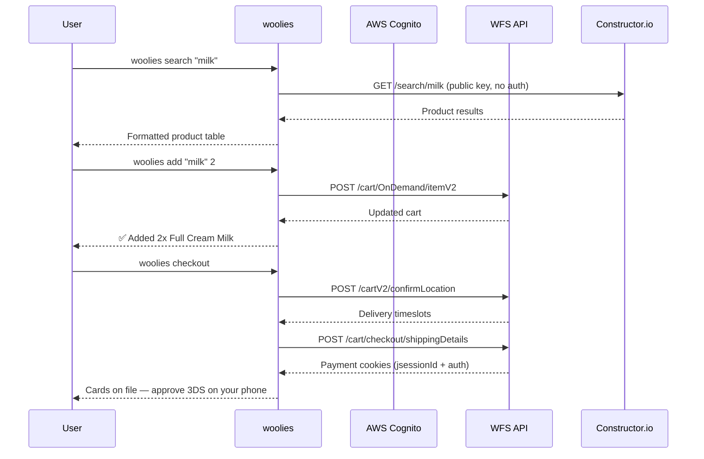
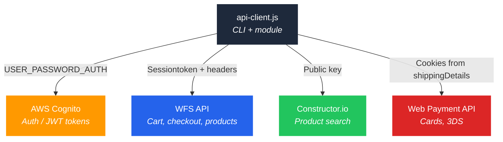

<h1 align="center">woolworths-cli</h1>

<p align="center">
  Order groceries from Woolworths Dash — from the command line.<br/>
  Search, cart, checkout, delivery slots. No browser required.<br/><br/>
  Built by <a href="https://github.com/yashiels">@yashiels</a>
</p>

<p align="center">
  <a href="https://github.com/yashiels/woolworths-cli/blob/main/LICENSE"></a>
  
  = 16" />
</p>

---

## Why

The Woolworths Dash app works, but it means unlocking your phone, opening the app, searching, scrolling, tapping — every single time.

`woolworths-cli` talks to the same API the Android app does, reverse-engineered from MITM captures of **app v10.11.0**. One command, instant results. Script it, pipe it, wire it into a cron job, or call it from your own code.

## Install

```sh
git clone https://github.com/yashiels/woolworths-cli.git
cd woolworths-cli

# Run directly
node api-client.js search "coconut water"

# Or link globally so 'woolies' works anywhere
npm link
woolies search "coconut water"
```

> **Note:** Not yet published to npm. For now, clone and `npm link` to get the global `woolies` command.

There is nothing to build and nothing to `npm install` — the only dependency is Node itself.

## Setup

### 1. Create a credentials file

The client reads from `~/.openclaw/credentials/woolworths-mobile.json`. Minimum:

```json
{
  "email": "you@example.com",
  "password": "your-password"
}
```

Everything else is discovered automatically on first login. The file is written back with `0600` permissions.

> 🔒 **Never commit this file.** It lives outside the repo by default.

### 2. Log in

```sh
woolies login
```

Performs a Cognito `USER_PASSWORD_AUTH` login and stores the resulting tokens. From then on the client auto-refreshes — you should rarely need to run `login` again.

### 3. IDs are discovered for you

| Field | How it's obtained |
|-------|-------------------|
| `dyn_user_id` | Decoded from the JWT `custom:AtgId` claim on login |
| `place_id` / `store_id` | Resolved from your saved address — run `woolies addresses` |

Optional fields you can add to the credentials file:

```json
{
  "place_id": "ChIJ...",
  "store_id": "...",
  "card_id": "usercc...",
  "cvv": "***"
}
```

`sha1password` is an APK-level constant baked into the client (same for every user, not derived from your password).

## Quick Start

```sh
# Search (no auth needed)
woolies search "coconut water"

# Add items to cart
woolies add "full cream milk" 2

# Check your cart
woolies cart

# Quick order — search and add in one step
woolies order "brown bread" 1

# Delivery slots
woolies timeslots

# Walk checkout up to the 3DS payment step
woolies checkout
```

### Example output

```
$ woolies search "coconut water"
Searching: "coconut water"

  #  Product                                   Price     SKU
  1  100 % Coconut Water 1 L                   R73.99    6009204330856
  2  100 % Coconut Water 330 ml                R32.99    6009204330863
  3  Coconut Flavoured Water 500 ml            R14.99    6009195780412
```

## How It Works



## Command Reference

| Command | Description |
|---------|-------------|
| `woolies search <query>` | Search products (Constructor.io, no auth) |
| `woolies cart` | Show cart contents + total |
| `woolies add <query\|sku> [qty]` | Add to cart by search or SKU (additive) |
| `woolies remove <query\|name\|ciId>` | Remove item by name, SKU, or commerceId |
| `woolies clear` | Empty the entire cart |
| `woolies order <query> [qty]` | Quick order: search + add in one step |
| `woolies addresses` | List saved delivery addresses |
| `woolies timeslots` | Show available delivery slots |
| `woolies checkout [slotIndex]` | Walk checkout to 3DS payment step |
| `woolies orders` | List past orders (best-effort) |
| `woolies token` | Show current token state + expiry |
| `woolies login` | Force a fresh Cognito login |
| `woolies help` | Show help |

### Exit Codes

| Code | Meaning |
|------|---------|
| `0` | Success |
| `1` | Error (API failure, auth issue, bad input) |

## Programmatic API

The same file is importable as a module:

```js
const { WoolworthsDash, TokenManager, CONFIG, decodeJwt } = require('./api-client');

const woolies = new WoolworthsDash();

// Search (no auth)
const results = await woolies.searchProducts('coconut water', { limit: 10 });

// Cart
const cart = await woolies.getCart();
await woolies.addItems([{ sku: '6009204330856', quantity: 2 }]);
await woolies.setItemQuantity('ci2115702714', 3);
await woolies.removeItem('ci2115702714');
await woolies.clearCart();

// Delivery
const addresses = await woolies.getAddresses();
const { slots, ctx } = await woolies.confirmLocation();

// Checkout (stops before 3DS)
const flow = await woolies.walkCheckout({ slotIndex: null });

// Orders
const { orders } = await woolies.getOrders();
```

### Ordering flow

1. `searchProducts(query)` → SKUs + prices
2. `addItems([{ sku, quantity }])` → adds to WFS cart (additive)
3. `getCart()` → items, total, count
4. `confirmLocation()` → confirms address, returns timeslots
5. `setShipping({ slot })` → selects slot, returns payment cookies
6. `getWebCards(jsessionId, auth)` → lists saved cards
7. **3DS payment** → approve on your bank app *(manual)*

`walkCheckout()` runs steps 1–6 and stops at step 7.

## Architecture



| Surface | Base URL | Auth |
|---------|----------|------|
| **Cognito** | `cognito-idp.eu-west-1.amazonaws.com` | App client ID; `USER_PASSWORD_AUTH` → JWT |
| **WFS** | `wfs-appserver.wigroup.co/wfs/app/v4` | `Sessiontoken` JWT + SHA1 + device headers |
| **Constructor.io** | `wpkmgeuco-zone.cnstrc.com` | Public key, no auth |
| **Web payment** | `www.woolworths.co.za/server` | Cookies from `shippingDetails` response |

## Gotchas

Hard-won quirks of the Woolworths API, all handled by the client:

1. **`Content-Type` required on GET.** WFS rejects GET requests without `Content-Type: application/json`. Uses `https.request()` instead of `fetch` to force the header.
2. **Cart is additive.** `woolies add "milk" 2` run twice = **4** in the cart, not 2. Use the cart view to check totals.
3. **Cart ops use `commerceId`, not SKU.** Updating/removing needs `commerceItemInfo.id` (e.g. `ci2115702714`), not the catalogue SKU.
4. **`placesId` vs `placeId`.** Saved addresses use `placesId` (with *s*); everything else uses `placeId`.
5. **Dash search filter is dead.** `filters[visibility]=Dash` returns zero results — search is unfiltered.
6. **SHA1 is an APK constant.** Same for everyone. Not derived from your password.
7. **Payment uses web cookies.** `/server/*` endpoints authenticate with `TOKEN` + `AUTHENTICATION` cookies from `shippingDetails`, not the `Sessiontoken` header.

## The 3DS Payment Caveat

**Payment cannot be fully automated.** Woolworths uses 3-D Secure, which sends a push notification to your bank app that you must approve on your phone. There is no API path around this.

`woolies checkout` walks you through: confirm location → pick timeslot → submit shipping → list cards — then **stops** and tells you to approve the 3DS push on your phone.

This is intentional. The "money leaves your account" step stays behind a human approval.

## Roadmap

- [x] Product search (Constructor.io)
- [x] Cart management (add, remove, clear)
- [x] Delivery address + timeslot selection
- [x] Checkout flow up to 3DS
- [x] Token auto-refresh
- [x] Programmatic Node.js API
- [ ] `woolies watch` — poll active order status
- [ ] Reorder from past orders
- [ ] `--json` flag for machine-readable output
- [ ] Publish to npm (`npm install -g woolworths-cli`)

## Contributing

PRs welcome. No build step — edit, test, ship.

```sh
git clone https://github.com/yashiels/woolworths-cli.git
cd woolworths-cli
npm test
```

## Disclaimer

This project is not affiliated with, endorsed by, or sponsored by Woolworths Holdings Limited or Woolworths (Pty) Ltd. Woolworths is a registered trademark of Woolworths Holdings Limited. This tool uses private mobile API endpoints reverse-engineered from the Woolworths Dash Android app — it can break without notice. Use at your own risk with your own account.

## License

[MIT](LICENSE) — Yashiel Sookdeo
