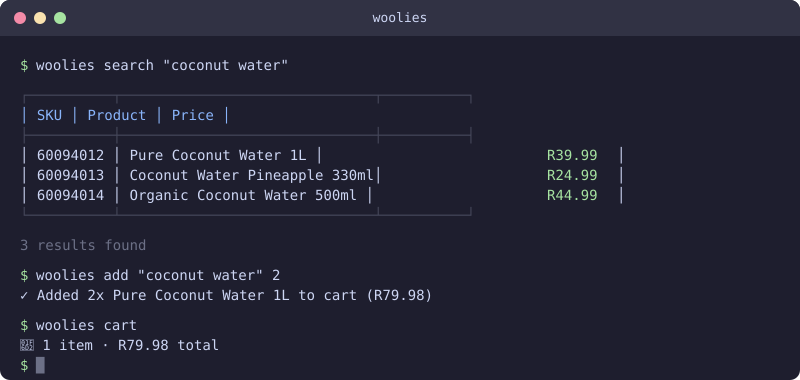

# 🛒 woolies

**Woolworths Dash grocery delivery from your shell.**



Search the catalogue, manage your cart, book a delivery slot, and walk the full checkout flow right up to the 3DS bank-approval step — all without leaving the terminal. Pure Node.js, zero dependencies, reverse-engineered from the Woolworths Dash Android app (v10.11.0).

## Install

### Homebrew (macOS & Linux)

```bash
brew install yashiels/tap/woolies
```

The formula auto-taps `yashiels/tap` on first install.

### Standalone binary

Download the latest pre-built binary from [GitHub Releases](https://github.com/yashiels/woolworths-cli/releases/latest):

| Platform | Binary |
|----------|--------|
| macOS (Apple Silicon) | `woolies-macos-arm64.tar.gz` |
| Linux (x86-64) | `woolies-linux-x64.tar.gz` |

### From source

```bash
git clone https://github.com/yashiels/woolworths-cli.git
cd woolworths-cli
node api-client.js help   # no npm install needed — zero dependencies
```

## Quick Start

```bash
# 1. Authenticate once — tokens are saved automatically
woolies login

# 2. Find something
woolies search "coconut water"

# 3. Add it to the cart (by query or exact SKU)
woolies add "full cream milk" 2
woolies add 6009204330856 1

# 4. Review the cart
woolies cart

# 5. See available delivery windows
woolies timeslots

# 6. Walk to checkout (stops before the 3DS step — approve on your bank app)
woolies checkout
```

## Commands

### Search & products

```bash
woolies search <query>          # search catalogue via Constructor.io (no auth needed)
```

### Cart

```bash
woolies cart                    # show cart contents + running total
woolies add <query|sku> [qty]   # add item by search query or SKU (quantity additive, default 1)
woolies remove <name|id>        # remove by name substring or commerceId (ci…)
woolies clear                   # empty the entire cart
woolies order <query> [qty]     # shortcut: search + add in one command
```

> **Heads-up — `add` is additive.** Calling `woolies add "milk" 2` twice puts 4 units in the cart, not 2. Use `woolies remove` first if you need to reset a quantity.

### Delivery

```bash
woolies addresses               # list saved addresses with placeId / storeId
woolies timeslots               # show available delivery windows for your default address
```

### Checkout

```bash
woolies checkout                # walk full checkout using the last available slot
woolies checkout <index>        # ...or a specific slot (0-indexed from `timeslots`)
woolies orders                  # list past orders
```

Checkout stops intentionally one step before submitting 3DS. Approve the push notification on your bank's app, then return to the terminal.

### Auth & diagnostics

```bash
woolies login                   # force a fresh Cognito login
woolies token                   # inspect token state and expiry
woolies help                    # print this command list
```

## Configuration

Credentials file: `~/.openclaw/credentials/woolworths-mobile.json`

Create it once before first login:

```json
{
  "email": "you@example.com",
  "password": "your-woolies-password"
}
```

**Optional fields** — omit any you don't need; `woolies` discovers them automatically after the first login:

| Field | Default | Description |
|-------|---------|-------------|
| `place_id` | auto | Delivery address place ID (discovered from default address) |
| `store_id` | auto | Associated store ID |
| `address_nickname` | auto | Address label used for confirmation |
| `card_id` | — | Default saved card ID for checkout |
| `cvv` | — | Card CVV (stored locally, never sent to Woolworths) |
| `driver_tip` | `0` | Driver tip in Rands |
| `api_base` | WFS default | Override WFS API base URL |

Cognito session and refresh tokens are written back to this file automatically and rotated transparently — you only need to re-run `woolies login` if the refresh token itself expires (typically after several weeks of inactivity).

## How It Works

```
woolies search  →  Constructor.io public API (no auth)
woolies add/cart/checkout  →  WFS (Woolworths Fulfilment Service) — Cognito IdToken
woolies checkout (payment)  →  Woolworths Web API — session cookies from WFS setShipping
```

1. **Auth** — `woolies login` uses Cognito `USER_PASSWORD_AUTH` to obtain a 24-hour IdToken and a long-lived RefreshToken, both stored in your credentials file. Every subsequent command calls `getSessionToken()`, which silently refreshes when the token is within 60 seconds of expiry.

2. **Product search** — routed through Constructor.io (the same search service the Woolworths app uses) with a public API key. No login needed.

3. **Cart & delivery** — all cart mutations, address lookups, and timeslot booking hit the WFS private API using the same headers the Android app sends (user-agent, APK version, device model).

4. **Checkout** — `setShipping` returns web-layer session cookies; these are used to fetch saved cards via the Woolworths website API. The final place-order call is intentionally not implemented — 3DS (3-D Secure) requires a push notification on your bank's app, so the CLI hands off at that boundary.

5. **Zero dependencies** — everything is implemented with `https`, `crypto`, `fs`, and `path` from the Node.js standard library. The binary builds use [Bun](https://bun.sh)'s `--compile` flag to bundle into a single self-contained executable.

## Releases

Releases are fully automated. Go to **Actions → Ship**, choose `patch`, `minor`, or `major`, and the workflow will:

1. Bump `version.env` and `package.json`
2. Compile standalone binaries (macOS arm64, Linux x64) via Bun
3. Create a GitHub Release with SHA-256–verified tarballs
4. Update the [Homebrew tap](https://github.com/yashiels/homebrew-tap) formula automatically

## Disclaimer

Not affiliated with Woolworths South Africa. This tool communicates with private, undocumented APIs that were reverse-engineered from the Woolworths Dash Android application. Use at your own risk. The APIs may change at any time without notice.

## License

MIT — © 2026 [Yashiel Sookdeo](https://github.com/yashiels)
